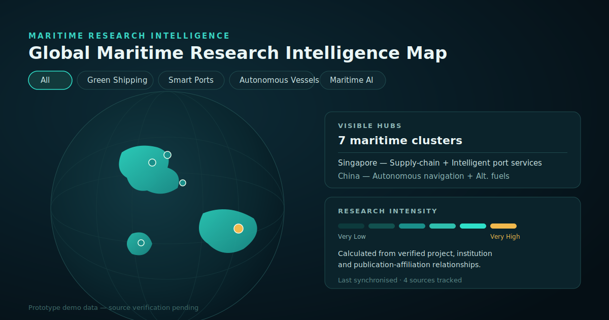
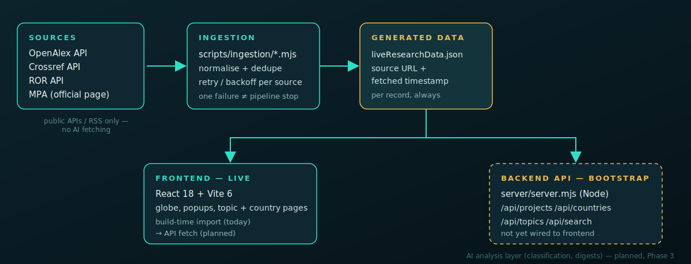

# Global Maritime Research Intelligence Map

An internal platform for SMI staff to explore global maritime research on
an interactive globe — projects by country, institution, topic and stage —
with AI analysis added only after extraction (planned, not yet built).

<p align="center">
  
</p>

## What this is, in one look

- A dark, rotatable **3D globe** where each glowing marker is a country
  with verified maritime R&D activity — brighter = more research intensity.
- Click a country or project marker to see **evidence-backed detail**:
  who's involved, what they're working on, and a link back to the source.
- Six **topic lenses** (green shipping, smart ports, autonomous vessels,
  maritime AI, alternative fuels, maritime cybersecurity) filter the whole
  globe at once.
- A **source status page** shows exactly which upstream feeds are live and
  when they last synced — nothing on the map is unverifiable.

## How data flows through the system

<p align="center">
  
</p>

Ingestion only ever talks to public APIs, RSS, or official pages directly
— never AI-driven page fetching — and one failing source never stops the
rest of the pipeline. Every real record keeps its source URL and fetched
timestamp.

## Current state

| Layer | Status |
|---|---|
| Frontend (React + Vite globe dashboard) | Working |
| Data ingestion (OpenAlex, Crossref, ROR, MPA) | Working, small prototype dataset — 500-record target still open |
| Backend API (`server/server.mjs`) | Bootstrap live (`/api/projects`, `/api/countries`, `/api/topics`, `/api/search`, ...) — frontend doesn't consume it yet, still a build-time import |
| AI analysis layer | Not built (Phase 3) |
| Lightsail deployment | Not configured (Phase 4) |

Full architecture rules and the phase-by-phase goal tracker live in
[`CLAUDE.md`](CLAUDE.md).

## Features

- Interactive rotatable maritime research globe (50m atlas, back-face
  culling, dual-LOD path caching for performance)
- Country and project marker popups, country profile panel
- Research-intensity country coloring (blue/cyan/teal; red = selection)
- Evidence-based project detail pages with source links
- Topic pages for all six research lenses
- Source status page at `/sources/status`
- Route-level code splitting for detail pages

## Tech stack

- React 18, React Router
- Vite 6
- d3-geo, topojson-client/simplify, world-atlas (50m)
- Framer Motion, Lucide React
- Vitest
- Node (zero-dependency) HTTP server for the backend API

## Getting started

```bash
npm.cmd install        # install dependencies
npm.cmd run dev         # start the dev server
npm.cmd test -- --run   # run tests
npm.cmd run build       # production build
```

## Data ingestion

```bash
npm.cmd run sync:data    # run once
npm.cmd run sync:watch   # run on a watch interval
```

Output goes to `src/data/generated/liveResearchData.json`, consumed by
the frontend at build time.

## Backend API (bootstrap, Phase 2)

```bash
npm.cmd run serve:api
```

Reads the same generated dataset and refreshes automatically when its
mtime changes — no restart needed after a re-sync. Configure with
`API_PORT` / `API_HOST` environment variables; no secrets in code.

## Project structure

```text
src/
  components/       UI components (globe, popups, cards, panels)
  pages/            Route-level pages (country, project, topic, sources)
  data/             Static + generated research data, topic/source config
  utils/            Intensity scoring, URL helpers
scripts/
  ingestion/        Extraction adapters (OpenAlex, Crossref, ROR, MPA) + pipeline
server/
  server.mjs        Backend API bootstrap over the generated dataset
docs/
  screenshots/      README illustrations
```

## Routes

`/`, `/country/:slug`, `/projects/:projectSlug`, `/sources/status`,
`/topic/green-shipping`, `/topic/smart-ports`, `/topic/autonomous-vessels`,
`/topic/maritime-ai`, `/topic/alternative-fuels`,
`/topic/maritime-cybersecurity`

## Notes

Mock/prototype data stays labelled "Prototype demo data - source
verification pending" until replaced by real ingested records. No
database, login, admin system or production security layer yet — those
land after the data model and API are stable.
